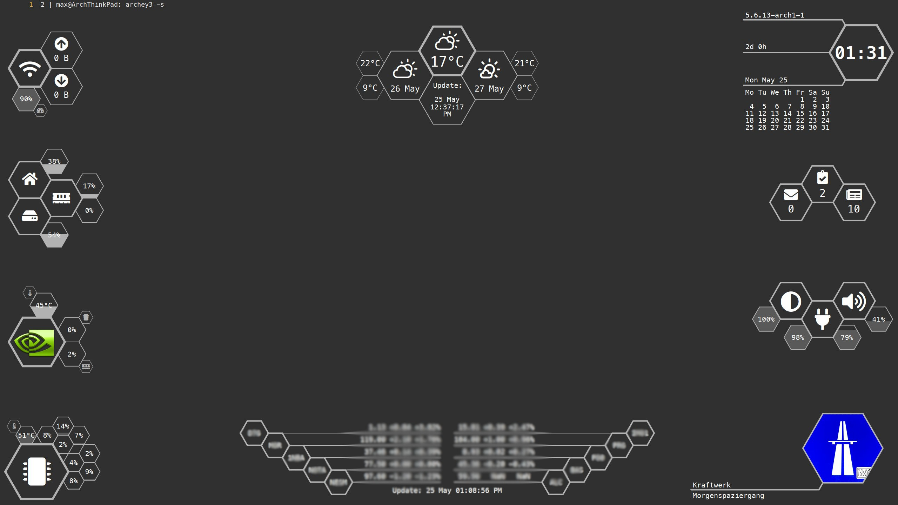

# dotfiles

System information:

* Window manager: [XMonad](https://xmonad.org/) and [picom](https://github.com/yshui/picom)
* Application manager: [rofi](https://github.com/davatorium/rofi)
* Statusbar: [dzen2](https://github.com/robm/dzen) and [conky](https://github.com/brndnmtthws/conky)
* Notifications: [dunst](https://dunst-project.org/) and [stalonetray](http://stalonetray.sourceforge.net/)
* Editor: [neovim](https://neovim.io/)
* Shell: [zsh](https://wiki.archlinux.org/index.php/Zsh)
* Terminal: [alacritty](https://github.com/alacritty/alacritty) and [tmux](https://github.com/tmux/tmux)
* Browser: [qutebrowser](https://qutebrowser.org/) and [buku](https://github.com/jarun/Buku)
* PDF Reader: [zathura](https://pwmt.org/projects/zathura/)
* File manager: [vifm](https://vifm.info/)
* Mail: [neomutt](https://neomutt.org/) and [isync](http://isync.sourceforge.net/) (mbsync)
* IRC: [weechat](https://weechat.org/)
* News: [newsboat](https://newsboat.org/)
* Notes: [notewarrior](https://gitlab.com/mrossinek/notewarrior)
* Tasks: [taskwarrior](https://taskwarrior.org/) and [timewarrior](https://timewarrior.net/)
* Calendar: [khal](https://lostpackets.de/khal/)
* Contacts: [khard](https://github.com/scheibler/khard)
* Sync: [vdirsyncer](https://github.com/pimutils/vdirsyncer) and [radicale](https://radicale.org/2.1.html)
* Music: [beets](https://beets.io/) and [mpc](https://www.musicpd.org/clients/mpc/)
* Video: [mpv](https://mpv.io/)

